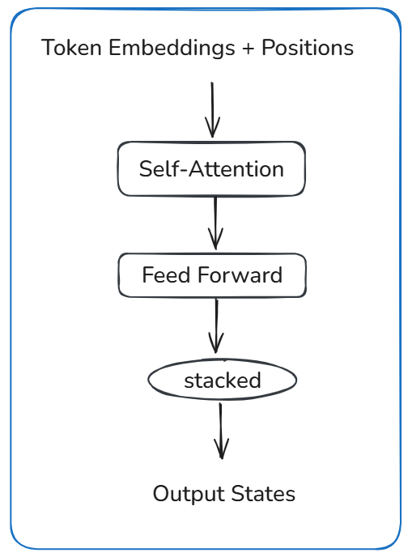

# Attention Is All You Need (2017)

## Core Idea
- Replace recurrence and convolution with attention over the full sequence.
- Model dependencies directly through pairwise interactions between tokens.
- Trade sequential inductive bias for parallelism and global context.
- Goal is to improve training efficiency and scaling behavior.

## Attention Mechanism

- Inputs are token embeddings with positional encodings added.
- Self-attention layers compute interactions between all token pairs.
- Feed-forward layers apply the same transformation at each position.
- Encoder stacks process inputs; decoder stacks attend to both prior outputs and encoder states.
- Training is fully parallel over sequence length.

## Tradeoffs
- Removing recurrence enables parallel training, but increases memory and compute with sequence length.
- Global attention captures long-range dependencies, but scales quadratically with input size.
- Fixed positional encoding simplifies structure, but weakens inductive bias for order.

## Mental Model
Instead of processing tokens one step at a time, the model looks at the entire sequence at once.
Each token decides which other tokens matter for its representation.
Training speeds up, but cost grows quickly as sequences get longer.

## Takeaway
Transformers shift sequence modeling from step-by-step computation to global interaction.
This improves training speed and representation power, but introduces scaling limits tied to attention cost.