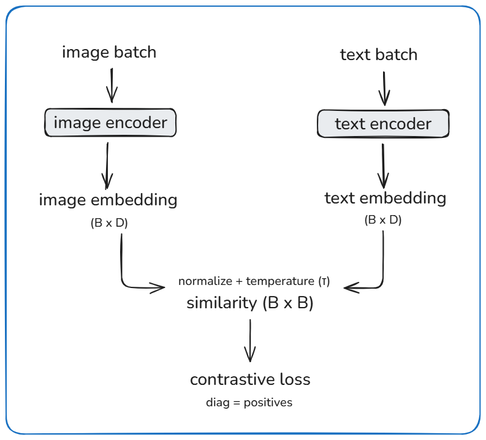

# CLIP: Learning Transferable Visual Models from Natural Language Supervision (2021)

## Core Idea
- Paired image–text data can be used to learn general-purpose visual representations without task-specific labels.
- Train image and text encoders jointly using contrastive learning.
- Align both modalities in a shared embedding space.
- Use natural language as a weak but scalable supervision signal.

## Model Structure

- An image encoder maps images to fixed-dimensional embeddings.
- A text encoder maps captions to embeddings in the same space.
- Training maximizes similarity between matched image–text pairs.
- At inference, image embeddings are compared against text embeddings for zero-shot tasks.

## Build Schematic

## Build Checklist

**Artifacts**
- Image encoder `f_img(·) -> R^D`
- Text encoder `f_txt(·) -> R^D`
- Temperature parameter `τ`

**Training Batch**
- `B` paired samples: `(img_i, txt_i)` for `i = 1..B`

**Compute**
- Normalize embeddings and compute similarity matrix  
  `S = img @ txt^T / τ`
- Loss: cross-entropy with diagonal entries as positives  
  (image → text and text → image)

**Serving**
- Freeze encoders
- Embed images and/or text
- Perform nearest-neighbor search in the shared embedding space  

## Tradeoffs
- Natural language supervision scales easily, but is noisy and imprecise.
- Contrastive training produces general embeddings, but weak task specialization.
- Zero-shot inference avoids retraining, but underperforms fine-tuned models on narrow tasks.

## Takeaway
Instead of teaching the model explicit labels, CLIP teaches images and text to agree.
If an image and caption often appear together, their embeddings move closer.
Downstream tasks become similarity lookups rather than learned classifiers.

