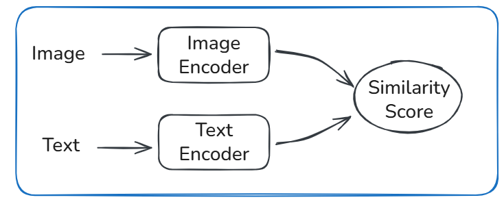

# CLIP: Learning Transferable Visual Models from Natural Language Supervision (2021)

## Core Idea
- Paired image–text data can be used to learn general-purpose visual representations without task-specific labels.
- Train image and text encoders jointly using contrastive learning.
- Align both modalities in a shared embedding space.
- Use natural language as a weak but scalable supervision signal.

## Model Structure

- An image encoder maps images to fixed-dimensional embeddings.
- A text encoder maps captions to embeddings in the same space.
- Training maximizes similarity between matched image–text pairs.
- At inference, image embeddings are compared against text embeddings for zero-shot tasks.

## Tradeoffs
- Natural language supervision scales easily, but is noisy and imprecise.
- Contrastive training produces general embeddings, but weak task specialization.
- Zero-shot inference avoids retraining, but underperforms fine-tuned models on narrow tasks.

## Mental Model
Instead of teaching the model explicit labels, CLIP teaches images and text to agree.
If an image and caption often appear together, their embeddings move closer.
Downstream tasks become similarity lookups rather than learned classifiers.

## Takeaway
CLIP trades task-specific accuracy for broad transfer and reuse.
It is most valuable when labels are scarce or tasks change frequently.
Performance comes from representation alignment, not task optimization.
