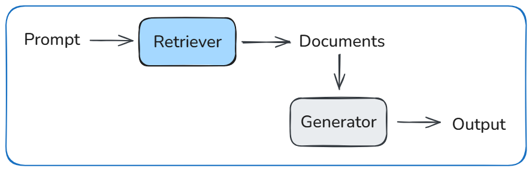

# Retrieval-Augmented Generation (RAG, 2020)

## Core Idea
- Combine parametric language models with external retrieval to improve factuality and knowledge access.
- Separate language generation from knowledge storage.
- Retrieve relevant documents at inference time.
- Condition generation on both the prompt and retrieved content.

## System Structure

  

- A retriever maps queries to relevant documents using dense embeddings.
- Retrieved documents are passed to a generator model as additional context.
- Generation marginalizes over multiple retrieved passages.
- Knowledge lives in an external index, not only in model weights.

## Tradeoffs
- External retrieval improves factual grounding, but adds latency and system complexity.
- Separating knowledge from parameters improves updateability, but weakens end-to-end optimization.
- Generation quality depends on retriever recall as much as generator capacity.

## Mental Model
The model does not rely only on what it memorized during training.
It looks things up first, then writes using what it found.
If retrieval fails, generation quality degrades regardless of model size.

## Takeaway
RAG moves knowledge access out of model weights and into retrieval.
This improves factual control and updateability, but shifts failure modes upstream.
System quality is bounded by retriever recall, not generator fluency.
